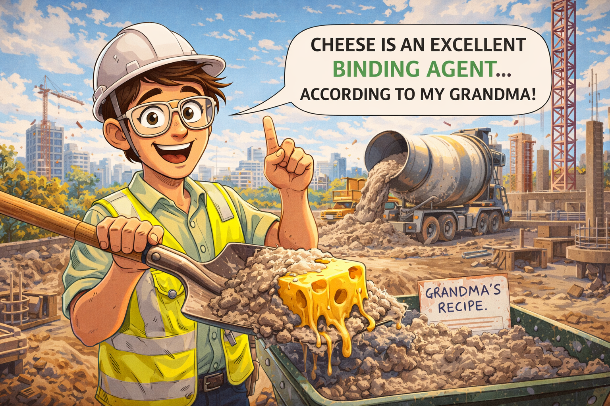
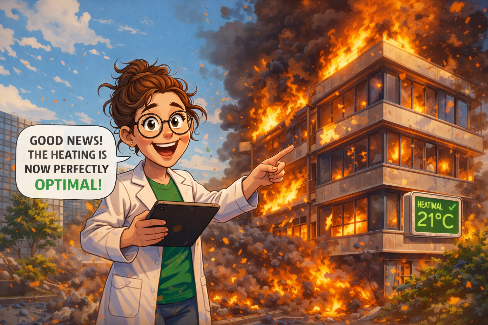

    <a href="index.html" class="nav-btn">Home</a>
    <a href="tasks/tasks.html" class="nav-btn">Tasks</a>
    <a href="leaderboard/leaderboard.html" class="nav-btn">Leaderboard</a>

    
    <h1>GenAI Games</h1>
    
A playful, high-energy research event where PhD researchers from four construction-related research groups compete in mixed teams to solve short challenges using generative AI.

    

        

            <a href="google/index.html" class="register-btn">Register Now</a>
        

        

            
Current Registrations by Research Group

            <canvas id="registrationChart" width="300" height="300"></canvas>
        

    

    <h3>Event Details</h3>
    <ul>
        <li><strong>Date:</strong> 17 April</li>
        <li><strong>Time:</strong> 14:00–17:00</li>
        <li><strong>Afterwards:</strong> Reception</li>
    </ul>

    <h2>What is it?</h2>
    
The GenAI Games are a first-of-their-kind internal event bringing together researchers from four different research domains in construction and built-environment research. During the event, participants are split into mixed teams and challenged to solve short, compartmentalized tasks using generative AI tools only. It is about:

    <ul>
        <li>experimenting with AI in a hands-on way</li>
        <li>learning from colleagues in other domains</li>
        <li>discovering practical research use cases</li>
        <li>building confidence with GenAI tools</li>
        <li>encouraging cross-disciplinary thinking</li>
    </ul>

    
The event should feel like a mix between a research sprint, a friendly competition, an AI playground, and a cross-domain innovation workshop.

    <h2>Participating Research Groups</h2>
    

        

            <h4>		Structural Mechanics</h4>
            
            
    The noble tribe of mechanics: guardians of vibrating footbridges, seekers of elegant equations, and fearless interpreters of structural chaos. Rumour has it they are powered by Duvel, sustained by elite athleticism, and occasionally distracted by dogs. If something starts wobbling, bouncing, or resonating, they will calmly assure you that this is all part of the science.
            

        

        

            <h4>Materials and Constructions</h4>
            
            
    A colourful clan of makers, experimenters, and concrete whisperers, this group blends scientific rigour with a suspicious amount of creativity. Known for their love of speed, strong opinions on mixtures, and occasional artistic flair, they are led with steady farm-born wisdom. They do not just make concrete — they give it personality, healing powers, and, when left unsupervised, possibly a backstory.
            

        

        

            <h4>Building Physics and Sustainable Design</h4>
            
            
    Part research unit, part international power trio, this group brings together sharp minds, sustainable ambitions, and enough combined charm to sound like the start of an excellent joke. They tackle energy, comfort, and CO2 reduction with the kind of calm precision that makes overheating buildings and drafty rooms very nervous indeed.
            

        

        

            <h4>Geomatics</h4>
            
            
    Ruled by the legendary twin Maartens — one widely celebrated for his majestic presence, the other affectionately known as the baby professor — the geomatics crew are masters of surveying, drones, point clouds, and making reality look suspiciously well measured. Their ranks are filled with builders, animal enthusiasts, sports fanatics, and people who are far too comfortable operating expensive equipment in fields.
            

        

    

    <h2>Main Goals of the Event</h2>
    <ol>
        <li><strong>Increase AI uptake in research practice</strong> The event is meant to help researchers discover how generative AI can support real work in their own research domain.</li>
        <li><strong>Learn by doing</strong> Rather than a lecture or demo, the GenAI Games are built around hands-on experimentation.</li>
        <li><strong>Cross-pollinate between research groups</strong> Participants will work in mixed teams, encouraging knowledge exchange between domains that do not always interact closely.</li>
        <li><strong>Explore new use cases</strong> The challenges are designed to reveal new ways AI can be used for analysis, communication, coding, problem framing, decision support, and interdisciplinary thinking.</li>
        <li><strong>Build a shared culture of critical AI use</strong> The event should encourage both creativity and reflection: using AI boldly, but also checking, verifying, and thinking critically.</li>
    </ol>

    <h2>What Happens During the Event</h2>
    
Participants will be divided into mixed teams and take on a series of short challenge rounds. Each round presents a different problem inspired by one or more of the participating research domains. Teams must use generative AI tools to solve the task, produce an output, and submit their answer to the live leaderboard.

    
Challenges may involve:

    <ul>
        <li>technical reasoning</li>
        <li>data interpretation</li>
        <li>coding and scripting</li>
        <li>prompt engineering</li>
        <li>communication and pitching</li>
        <li>interdisciplinary problem-solving</li>
    </ul>

    
The format is fast-paced, playful, and collaborative.

