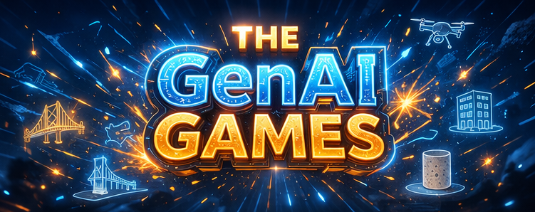
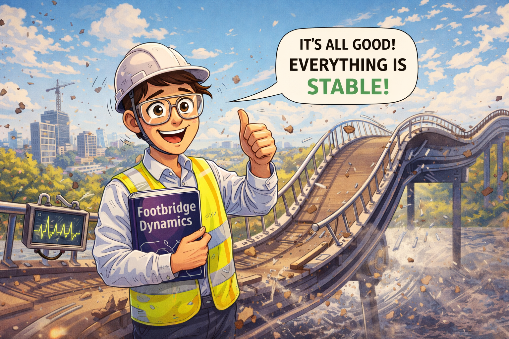
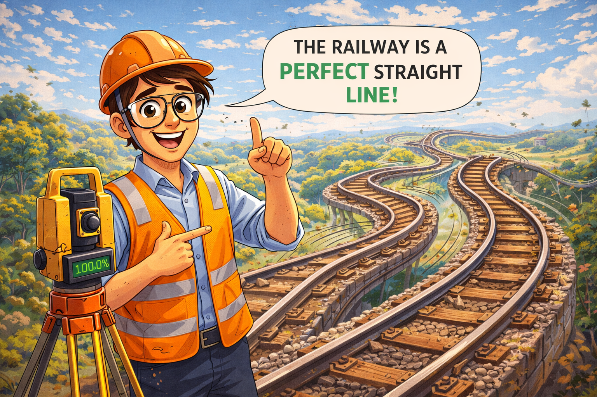

    
    <h1>GenAI Games</h1>
    
A playful, high-energy research event where PhD researchers from four construction-related research groups compete in mixed teams to solve short challenges using generative AI.

    <a href="https://script.google.com/macros/s/AKfycbxCoBleob-wSKjMc0T73_w1ayv3pAr-28gYBQ3LTamRQnzKVH7BFWdcJit4HgRbrvRzPg/exec" class="register-btn">Register Now</a>

    <h2>What is it?</h2>
    
The GenAI Games are a first-of-their-kind internal event bringing together researchers from four different research domains in construction and built-environment research. During the event, participants are split into mixed teams and challenged to solve short, compartmentalized tasks using generative AI tools only.

    
The event is not about being an AI expert. It is about:

    <ul>
        <li>experimenting with AI in a hands-on way</li>
        <li>learning from colleagues in other domains</li>
        <li>discovering practical research use cases</li>
        <li>building confidence with GenAI tools</li>
        <li>encouraging cross-disciplinary thinking</li>
    </ul>

    
The event should feel like a mix between a research sprint, a friendly competition, an AI playground, and a cross-domain innovation workshop.

    <h3>Event Details</h3>
    <ul>
        <li><strong>Date:</strong> 17 April</li>
        <li><strong>Time:</strong> 14:00–17:00</li>
        <li><strong>Afterwards:</strong> Reception</li>
    </ul>

    <h2>Participating Research Groups</h2>
    

        

            <h4>Dynamics of Footbridges</h4>
            
            
This group focuses on the dynamic behaviour of footbridges, including vibration performance, pedestrian-induced loading, and structural comfort and safety. Their work deals with how bridges behave under real use and how design and analysis can improve user experience and structural reliability.

        

        

            <h4>Concrete Compositions and Healing Concretes</h4>
            
            
This group works on concrete materials, including innovative mix designs and self-healing or healing-enhanced concretes. Their research explores performance, durability, sustainability, and novel ways to improve construction materials.

        

        

            <h4>Sustainable Buildings</h4>
            
            
This group focuses on sustainable buildings, with themes including energy performance, indoor comfort, and CO2 reduction. Their work addresses the transition to more efficient, comfortable, and lower-carbon buildings and built environments.

        

        

            <h4>Geomatics</h4>
            
            
This group works on surveying, UAV flights, spatial data capture, and point cloud processing. Their research includes digital representations of buildings and infrastructure, measurement technologies, and advanced data processing workflows.

        

    

    <h2>Event Preview</h2>
    

        

            <h4>Introduction Video</h4>
            <video controls style="width: 100%; max-width: 400px;">
                <source src="intro_video.mp4" type="video/mp4">
                Your browser does not support the video tag.
            </video>
        

        

            <h4>Building Physics Demo</h4>
            <video controls style="width: 100%; max-width: 400px;">
                <source src="building_physics.mp4" type="video/mp4">
                Your browser does not support the video tag.
            </video>
        

        

            <h4>Concrete Research</h4>
            <video controls style="width: 100%; max-width: 400px;">
                <source src="concrete.mp4" type="video/mp4">
                Your browser does not support the video tag.
            </video>
        

        

            <h4>Dynamics Research</h4>
            <video controls style="width: 100%; max-width: 400px;">
                <source src="dynamics.mp4" type="video/mp4">
                Your browser does not support the video tag.
            </video>
        

    

    <h2>Main Goals of the Event</h2>
    <ol>
        <li><strong>Increase AI uptake in research practice</strong> The event is meant to help researchers discover how generative AI can support real work in their own research domain.</li>
        <li><strong>Learn by doing</strong> Rather than a lecture or demo, the GenAI Games are built around hands-on experimentation.</li>
        <li><strong>Cross-pollinate between research groups</strong> Participants will work in mixed teams, encouraging knowledge exchange between domains that do not always interact closely.</li>
        <li><strong>Explore new use cases</strong> The challenges are designed to reveal new ways AI can be used for analysis, communication, coding, problem framing, decision support, and interdisciplinary thinking.</li>
        <li><strong>Build a shared culture of critical AI use</strong> The event should encourage both creativity and reflection: using AI boldly, but also checking, verifying, and thinking critically.</li>
    </ol>

    <h2>What Happens During the Event</h2>
    
Participants will be divided into mixed teams and take on a series of short challenge rounds. Each round presents a different problem inspired by one or more of the participating research domains. Teams must use generative AI tools to solve the task, produce an output, and submit their answer to the live leaderboard.

    
Challenges may involve:

    <ul>
        <li>technical reasoning</li>
        <li>data interpretation</li>
        <li>coding and scripting</li>
        <li>prompt engineering</li>
        <li>communication and pitching</li>
        <li>interdisciplinary problem-solving</li>
    </ul>

    
The format is fast-paced, playful, and collaborative.

    <h3>Key Message to Participants</h3>
    
Whether you already use AI every day or have barely tried it, the GenAI Games are designed as a safe, fun environment to experiment, learn, and discover what these tools can mean for your research.

    
<strong>No advanced AI experience is required. Curiosity matters more than expertise. Beginners are welcome. The goal is learning and exploration, not perfection.</strong>

3. **Cross-pollinate between research groups**  
   Participants will work in mixed teams, encouraging knowledge exchange between domains that do not always interact closely.

4. **Explore new use cases**  
   The challenges are designed to reveal new ways AI can be used for analysis, communication, coding, problem framing, decision support, and interdisciplinary thinking.

5. **Build a shared culture of critical AI use**  
   The event should encourage both creativity and reflection: using AI boldly, but also checking, verifying, and thinking critically.

## What Happens During the Event

Participants will be divided into mixed teams and take on a series of short challenge rounds. Each round presents a different problem inspired by one or more of the participating research domains. Teams must use generative AI tools to solve the task, produce an output, and submit their answer to the live leaderboard.

Challenges may involve:
- technical reasoning
- data interpretation
- coding and scripting
- prompt engineering
- communication and pitching
- interdisciplinary problem-solving

The format is fast-paced, playful, and collaborative.

## Key Message to Participants

Whether you already use AI every day or have barely tried it, the GenAI Games are designed as a safe, fun environment to experiment, learn, and discover what these tools can mean for your research.

No advanced AI experience is required. Curiosity matters more than expertise. Beginners are welcome. The goal is learning and exploration, not perfection.

## Register

[Register for GenAI Games](google/index.html)