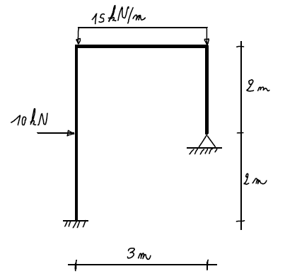

    <a href="../index.html" class="nav-btn">Home</a>
    <a href="tasks.html" class="nav-btn">Tasks</a>
    <a href="../leaderboard/leaderboard.html" class="nav-btn">Leaderboard</a>

    

        
    

    <h2>Task 4: Just Give Me a Moment</h2>
    
<strong>Type:</strong> Technical Reasoning — Steel Structure

    
    

        
        
<em>Problem outline and reference diagram</em>

    

    
    <h3>Goal</h3>
    
Solve a structural reasoning task on the steel frame in the provided file. Determine the bending moment representation, the vertical reaction at the left support, and the maximum vertical displacement of the horizontal beam.

    
    <h3>Brief</h3>
    
Use AI to support your structural reasoning, identify the right formulas and assumptions, and produce a clear engineering answer.

    
    <h3>Rules</h3>
    <ul>
        <li>No coding required</li>
        <li>AI may be used for reasoning, checking formulas, structuring, and explanation</li>
        <li>Final answer must be coherent and technically justified</li>
    </ul>
    
    <h3>Deliverables</h3>
    <ul>
        <li>Final numerical answers</li>
        <li>Short explanation of the reasoning path</li>
        <li>One sentence on what was manually checked</li>
        <li>"How we did it" documentation</li>
    </ul>
    
    <h3>Scoring Criteria</h3>
    <ul>
        <li><strong>Correctness:</strong> Are the answers correct?</li>
        <li><strong>Engineering Logic:</strong> Is the reasoning sound?</li>
        <li><strong>Clarity:</strong> Is the explanation clear?</li>
        <li><strong>Verification Quality:</strong> How well was the answer checked?</li>
    </ul>
    
    <h3>What It Teaches</h3>
    <ul>
        <li>AI for technical reasoning and problem solving</li>
        <li>Formula retrieval and interpretation</li>
        <li>Structured problem solving</li>
        <li>Verification of engineering results</li>
    </ul>
    
    <h3>How We Did It — Report Required</h3>
    
Your team must report:

    <ul>
        <li>Which AI tool you used</li>
        <li>The main prompt or prompting sequence</li>
        <li>Whether you asked AI for formulas, steps, or checks</li>
        <li>What you verified manually</li>
    </ul>
    
    <h3>Data and Resources</h3>
    <a href="#" class="download-btn">Download Steel Frame Problem</a>
    
    <h3>Submission</h3>
    <a href="#" class="submit-btn">Submit Solution & Report</a>

