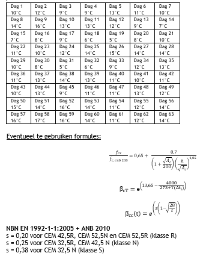

    <a href="../index.html" class="nav-btn">Home</a>
    <a href="tasks.html" class="nav-btn">Tasks</a>
    <a href="../leaderboard/leaderboard.html" class="nav-btn">Leaderboard</a>

    

        

            <h2 style="margin: 0;">Task 5: Time to Start Cracking</h2>
            
<strong>Type:</strong> Technical Reasoning — Concrete

        

        
    

    
    

        
        
<em>Problem reference diagram</em>

    

    <h3>Brief</h3>
    
Use AI to reason through the hydration problem, organize the required calculations, and explain the physical meaning of the result.

    <h3>Problem Statement</h3>
    
    <h4>1. Hydration of Portland Cement</h4>
    
<strong>Part a) Sealed System Hydration:</strong>

    
Consider a cement paste consisting of 100 g cement and 37 g water. Draw the corresponding Powers diagram and provide your calculations.

    
    
<strong>Part b) External Water Available:</strong>

    
Now assume water becomes available from outside the system after the initial hydration. Can additional cement hydrate, and if so, how much?

    
    <h4>2. Concrete Compressive Strength</h4>
    
A concrete element is cast on 'Day 1' in the morning. The cement used is CEM I 52.5 N. At the same time, control cubes (200 mm sides) are made and stored under ideal laboratory conditions.

    
    
<strong>Given:</strong> After 14 days, the average compressive strength of the control cubes is fcm,cub200,14d = 48 N/mm²

    
    
<strong>Question:</strong> When will an average compressive strength of fcm,cub150 = 45 N/mm² be reached on the construction site? (Average daily temperatures provided in a table)

    
    
    

    
    <h3>Deliverables</h3>
    <ul>
        <li>Final answer</li>
        <li>Short explanation of the reasoning</li>
        <li>"How we did it" documentation</li>
    </ul>
    
    <h3>Scoring Criteria</h3>
    <ul>
        <li><strong>Correctness:</strong> Is the answer accurate?</li>
        <li><strong>Clarity:</strong> Is the explanation clear?</li>
        <li><strong>Reasoning Quality:</strong> Is the logic sound?</li>
    </ul>
    
    <h3>What It Teaches</h3>
    <ul>
        <li>AI for materials science reasoning</li>
        <li>Combining equations with conceptual understanding</li>
        <li>Explaining scientific calculations clearly</li>
    </ul>

    
    
    <h3>Submission</h3>
    <a href="https://kuleuven-my.sharepoint.com/:f:/g/personal/maarten_bassier_kuleuven_be/IgDWXqXngeB1RZ41G5HnvCG-AY9Z1YX5woyZBmJXPOpawkw?e=IKLclh" class="submit-btn" target="_blank" rel="noopener noreferrer">Submit Solution & Report</a>

