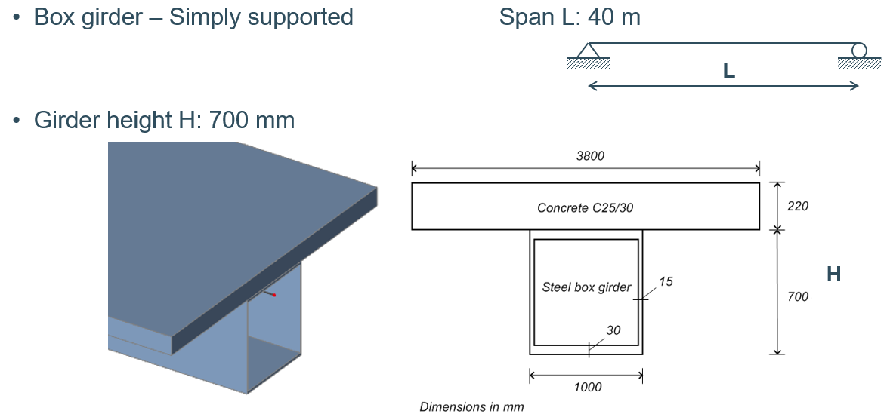

    <a href="../index.html" class="nav-btn">Home</a>
    <a href="tasks.html" class="nav-btn">Tasks</a>
    <a href="../leaderboard/leaderboard.html" class="nav-btn">Leaderboard</a>

    

        

            <h2 style="margin: 0;">Task 6: Good Vibes</h2>
            
<strong>Type:</strong> Technical Reasoning — Footbridge Dynamics

        

        
    

    
    

        
        
        
<em>Problem reference diagrams</em>

    

    
    <h3>Problem Statement</h3>
    
<strong>Structure:</strong> Inspired by Parkbos footbridge with steel box section and concrete deck

    
    <h3>Questions to Solve:</h3>
    <ol>
        <li><strong>Fundamental Frequency:</strong> What is the fundamental vertical natural frequency in Hz?</li>
        <li><strong>Tuned Mass Damper:</strong> What is the required mass of a Tuned Mass Damper (TMD) attached at midspan to reduce the contribution of the first mode to the acceleration level by a factor of 10 (corresponding to an increase in damping from 0.4% to 4%)?</li>
        <li><strong>Frequency Response Function:</strong> Present the frequency response function (FRF) for input and output at midspan without and with the TMD</li>
    </ol>
    
    <h3>Brief</h3>
    
Use AI to support structural dynamics reasoning, calculation setup, and interpretation.

    
    <h3>Deliverables</h3>
    <ul>
        <li>Final numerical answers</li>
        <li>Short reasoning note</li>
        <li>Interpretation of what the TMD achieves</li>
        <li>"How we did it" documentation</li>
    </ul>
    
    <h3>Scoring Criteria</h3>
    <ul>
        <li><strong>Correctness:</strong> Are answers within ±5% of target?</li>
        <li><strong>Reasoning Quality:</strong> Is the logic sound?</li>
        <li><strong>Interpretation:</strong> Is the physical meaning clear?</li>
        <li><strong>Clarity:</strong> Are explanations clear?</li>
    </ul>
    
    <h3>What It Teaches</h3>
    <ul>
        <li>AI for dynamics reasoning and problem solving</li>
        <li>Technical problem structuring</li>
        <li>Interpreting damping and response reduction</li>
        <li>Identifying where AI is reliable or unreliable in advanced mechanics</li>
    </ul>
    
    
    <h3>Submission</h3>
    <a href="#" class="submit-btn">Submit Solution & Report</a>

