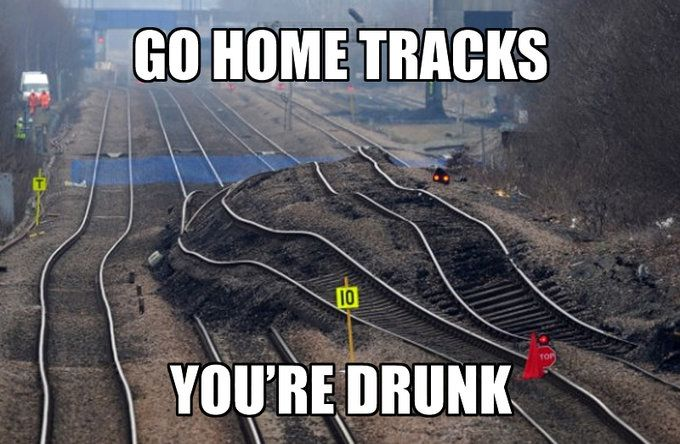

    <a href="../index.html" class="nav-btn">Home</a>
    <a href="tasks.html" class="nav-btn">Tasks</a>
    <a href="../leaderboard/leaderboard.html" class="nav-btn">Leaderboard</a>

    

        
    

    <h2>Task 8: CHOO CHOO</h2>
    
<strong>Type:</strong> Technical Coding + Depth + Visualization

    
    <h3>Goal</h3>
    
Extract railway gauge values along a railway section and visualize whether the gauge is within tolerance at each interval.

    
    <h3>Brief</h3>
    
<strong>Focus:</strong> Gauge aspect only. The broader spoor analysis documents are context only.

    
    
The original railway exercise covers many analyses (scanner accuracy, slope, centerline, cant), but for this task you only work on gauge extraction and compliance visualization.

    
    
Teams are given:

    <ul>
        <li>Point cloud dataset</li>
        <li>Relevant specification excerpt</li>
        <li>Presentation showing the gauge location</li>
    </ul>
    
    
Use AI to help design and implement a workflow that:

    <ul>
        <li>Extracts the gauge parameter every 0.5 m</li>
        <li>Compares each value to tolerance</li>
        <li>Visualizes whether each location is in or out of tolerance</li>
    </ul>
    
    <h3>Rules</h3>
    <ul>
        <li>Focus on gauge only</li>
        <li>Emphasize both technical depth and clear visualization</li>
        <li>Backend code and visual output are both part of the challenge</li>
        <li>Teams may simplify the pipeline if they explain their assumptions</li>
    </ul>
    
    <h3>Deliverables</h3>
    <ul>
        <li>Extracted gauge values</li>
        <li>Tolerance classification</li>
        <li>Visualization along the section</li>
        <li>Short explanation of method and assumptions</li>
        <li>"How we did it" documentation</li>
    </ul>
    
    <h3>Scoring Criteria</h3>
    <ul>
        <li><strong>Technical Depth:</strong> Is the approach sound and sophisticated?</li>
        <li><strong>Correctness:</strong> Are calculations and logic correct?</li>
        <li><strong>Visualization Quality:</strong> Is the output clear and readable?</li>
        <li><strong>Robustness:</strong> Is the workflow well-structured?</li>
        <li><strong>Clarity:</strong> Are assumptions clearly stated?</li>
    </ul>
    
    <h3>What It Teaches</h3>
    <ul>
        <li>AI for pipeline design</li>
        <li>AI for code generation and debugging</li>
        <li>AI for linking standards/specifications to data workflows</li>
        <li>Turning spatial data into interpretable engineering outputs</li>
    </ul>
    
    <h3>How We Did It — Report Required</h3>
    
Your team must report:

    <ul>
        <li>Which AI tools you used for code, interpretation, or workflow design</li>
        <li>How you asked AI to understand the gauge specification</li>
        <li>What processing steps were AI-generated versus human-designed</li>
        <li>Where the workflow was fragile or required manual intervention</li>
    </ul>
    
    <h3>Data and Resources</h3>
    <a href="#" class="download-btn">Download Point Cloud & Specs</a>
    
    <h3>Submission</h3>
    <a href="#" class="submit-btn">Submit Solution & Report</a>

