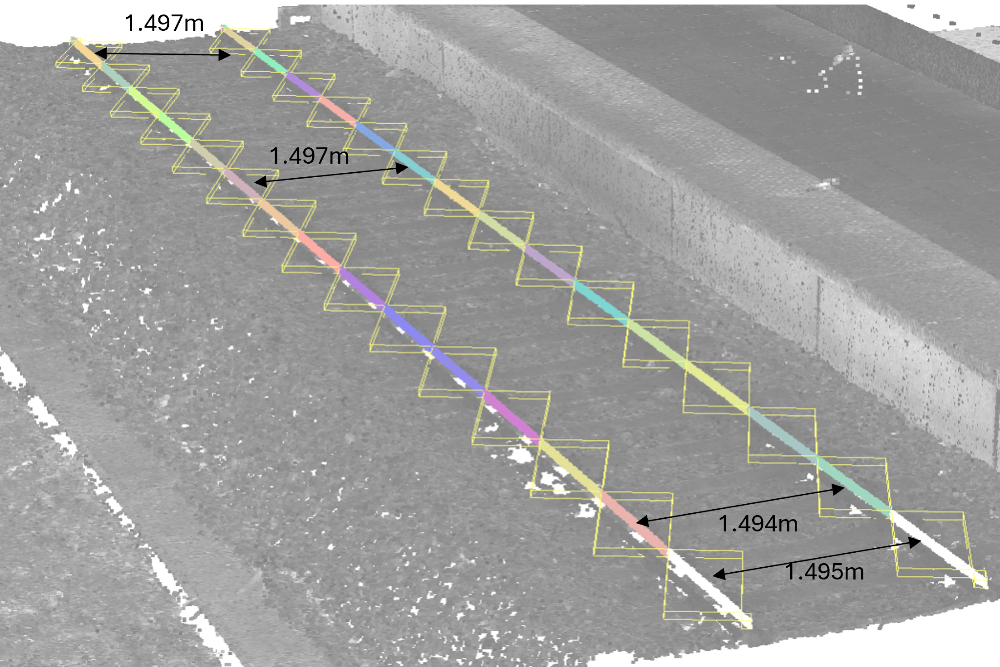
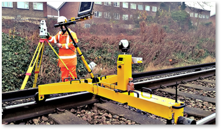

    <a href="../index.html" class="nav-btn">Home</a>
    <a href="tasks.html" class="nav-btn">Tasks</a>
    <a href="../leaderboard/leaderboard.html" class="nav-btn">Leaderboard</a>

    

        

            <h2 style="margin: 0;">Task 8: CHOO CHOO</h2>
            
<strong>Type:</strong> Technical Coding + Depth + Visualization

        

        
    

    
    <h3>Problem Statement</h3>
    
<strong>Context:</strong> Railway gauge analysis based on point cloud survey data. Reference: <a href="https://infrabel.be/sites/default/files/wysiwyg-files/Bundel-32.pdf" target="_blank">Infrabel Bundle 32 (Technical Specifications)</a>

    
    <h4>Question 1: Gauge Measurement</h4>
    
Extract the gauge parameter (distance between the two rails) at regular intervals of <strong>every 0.5 m</strong> along the measured section. Provide the extracted gauge values and document your methodology.

    
    <h4>Question 2: Tolerance Compliance Visualization</h4>
    
Create a visualization showing:

    <ul>
        <li>Which measurement points are <strong>within tolerance</strong> (shown in green)</li>
        <li>Which measurement points are <strong>out of tolerance</strong> (shown in red)</li>
        <li>The tolerance corridor boundaries</li>
        <li>Distance along the track on the x-axis</li>
    </ul>
    
This visualization should clearly communicate where maintenance or track correction is needed.

    
    

        
        
        
<em>Problem reference diagrams and specifications</em>

    

    
    <h3>Brief</h3>
    
<strong>Focus:</strong> Gauge aspect only. The broader spoor analysis documents are context only.

    
    
The original railway exercise covers many analyses (scanner accuracy, slope, centerline, cant), but for this task you only work on gauge extraction and compliance visualization.

    
    
Teams are given:

    <ul>
        <li>Point cloud dataset</li>
        <li>Relevant specification excerpt</li>
        <li>Presentation showing the gauge location</li>
    </ul>
    
    
Use AI to help design and implement a workflow that:

    <ul>
        <li>Extracts the gauge parameter every 0.5 m</li>
        <li>Compares each value to tolerance</li>
        <li>Visualizes whether each location is in or out of tolerance</li>
    </ul>
    
    <h3>Rules</h3>
    <ul>
        <li>Focus on gauge only</li>
        <li>Emphasize both technical depth and clear visualization</li>
        <li>Backend code and visual output are both part of the challenge</li>
        <li>Teams may simplify the pipeline if they explain their assumptions</li>
    </ul>
    
    <h3>Deliverables</h3>
    <ul>
        <li>Extracted gauge values</li>
        <li>Tolerance classification</li>
        <li>Visualization along the section</li>
        <li>"How we did it" documentation</li>
    </ul>
    
    <h3>Scoring Criteria</h3>
    <ul>
        <li><strong>Technical Depth:</strong> Is the approach sound and sophisticated?</li>
        <li><strong>Correctness:</strong> Are calculations and logic correct?</li>
        <li><strong>Visualization Quality:</strong> Is the output clear and readable?</li>
        <li><strong>Robustness:</strong> Is the workflow well-structured?</li>
    </ul>
    
    <h3>What It Teaches</h3>
    <ul>
        <li>AI for pipeline design</li>
        <li>AI for code generation and debugging</li>
        <li>AI for linking standards/specifications to data workflows</li>
        <li>Turning spatial data into interpretable engineering outputs</li>
    </ul>
    
    <h3>Data and Resources</h3>
    
<a href="https://kuleuven-my.sharepoint.com/:u:/g/personal/maarten_bassier_kuleuven_be/IQCDXw9Rk6e8Qq6tNMkCHfLrATOkndTcQFlDHzBR24PHQx4?e=9yt8b8" class="download-btn" target="_blank">Download Point Cloud Dataset</a>

    
    <h3>Submission</h3>
    <a href="https://kuleuven-my.sharepoint.com/:f:/g/personal/maarten_bassier_kuleuven_be/IgDWXqXngeB1RZ41G5HnvCG-AY9Z1YX5woyZBmJXPOpawkw?e=IKLclh" class="submit-btn" target="_blank" rel="noopener noreferrer">Submit Solution & Report</a>

