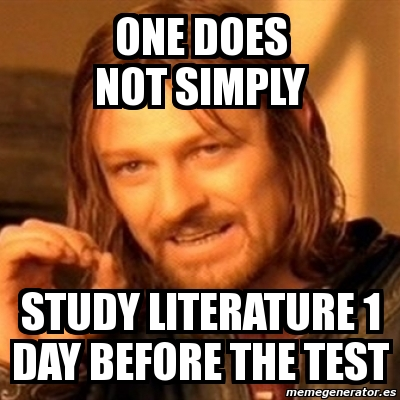
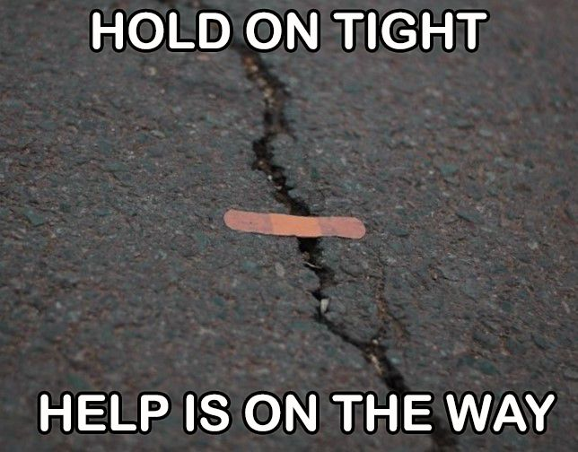
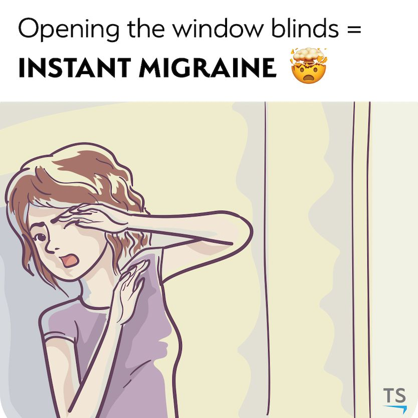

    <a href="../index.html" class="nav-btn">Home</a>
    <a href="tasks.html" class="nav-btn">Tasks</a>
    <a href="../leaderboard/leaderboard.html" class="nav-btn">Leaderboard</a>

    <h2>GenAI Games — Tasks & Submission Rules</h2>
    
Here you will find information about the challenges, data downloads, and submission guidelines for the GenAI Games.

    
    <h3>General Submission Rules for All Tasks</h3>
    
<strong>Each team submission must include:</strong>

    <ul>
        <li><strong>Team name</strong></li>
        <li><strong>Main output</strong> (the solution/deliverable)</li>
        <li><strong>How we did it</strong> — This is important! The goal is not only to solve the task, but also to <strong>learn how different AI approaches work</strong></li>
            <li><strong>AI tools used</strong> — Which tools did you employ?</li>
            <li><strong>Main prompt or workflow</strong> — What did you ask the AI to do?</li>
            <li><strong>What we checked manually</strong> — Did you verify the AI output?</li>
            <li><strong>Where AI helped most</strong> — Which part of the task did AI solve best?</li>
            <li><strong>Confidence level: 1–5</strong> — How confident are you in your solution?</li>
    </ul>
    

    <h2>8 Challenges</h2>
    

        

            
            <h3><a href="assignment1.html">Task 1: Bumbling Baboon</a></h3>
            
<strong>Type:</strong> Presentation / Communication Create a 5-minute presentation on another group's research topic using AI.

            

                <a href="#" class="download-btn">Download Brief</a>
                <a href="#" class="submit-btn">Submit</a>
            

        

        

            
            <h3><a href="assignment2.html">Task 2: Picasso, Is That You?</a></h3>
            
<strong>Type:</strong> Poster / Visual Communication Create an A1 research poster introducing a Ghent research domain.

            

                <a href="#" class="download-btn">Download Brief</a>
                <a href="#" class="submit-btn">Submit</a>
            

        

        

            
            <h3><a href="assignment3.html">Task 3: Into the Blue</a></h3>
            
<strong>Type:</strong> Research / Literature Mapping Produce a one-page literature scan on a narrowly scoped research question.

            

                <a href="#" class="download-btn">Download Brief</a>
                <a href="#" class="submit-btn">Submit</a>
            

        

        

            
            <h3><a href="assignment4.html">Task 4: Just Give Me a Moment</a></h3>
            
<strong>Type:</strong> Technical Reasoning (Steel) Solve a structural steel frame problem using AI support.

            

                <a href="#" class="download-btn">Download Brief</a>
                <a href="#" class="submit-btn">Submit</a>
            

        

        

            
            <h3><a href="assignment5.html">Task 5: Time to Start Cracking</a></h3>
            
<strong>Type:</strong> Technical Reasoning (Concrete) Solve a cement hydration problem using AI reasoning.

            

                <a href="#" class="download-btn">Download Brief</a>
                <a href="#" class="submit-btn">Submit</a>
            

        

        

            
            <h3><a href="assignment6.html">Task 6: Good Vibes</a></h3>
            
<strong>Type:</strong> Technical Reasoning (Dynamics) Solve a footbridge vibration problem with TMD design.

            

                <a href="#" class="download-btn">Download Brief</a>
                <a href="#" class="submit-btn">Submit</a>
            

        

        

            
            <h3><a href="assignment7.html">Task 7: And Then There Was Light</a></h3>
            
<strong>Type:</strong> Coding + Visualization Compute daylight metrics and create a pass/fail floor-plan visualization.

            

                <a href="#" class="download-btn">Download Brief</a>
                <a href="#" class="submit-btn">Submit</a>
            

        

        

            
            <h3><a href="assignment8.html">Task 8: CHOO CHOO</a></h3>
            
<strong>Type:</strong> Advanced Coding + Depth Extract railway gauge values and visualize tolerance compliance.

            

                <a href="#" class="download-btn">Download Brief</a>
                <a href="#" class="submit-btn">Submit</a>
            

        

    

